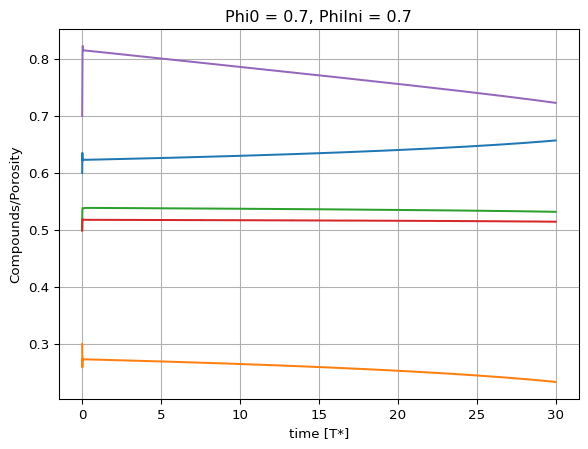

# 18_11_2023_18_33_38

``` python
Solution_path = '../../../data/18_11_2023_18_33_38/LMAHeureuxPorosityDiff.hdf5'
```

``` python
import h5py
Solution = h5py.File(Solution_path, 'r')
data = Solution['data']
```

``` python
import matplotlib.pyplot as plt
import numpy as np
t = np.array(Solution['times'][:])
s = np.array(data[:,:,0])
fig, ax = plt.subplots()
ax.plot(t, s)
ax.set(xlabel='time [T*]', ylabel='Compounds/Porosity',
       title=f"Phi0 = {Solution.attrs['Phi0']}, PhiIni = {Solution.attrs['PhiIni']}")
ax.grid()
```


